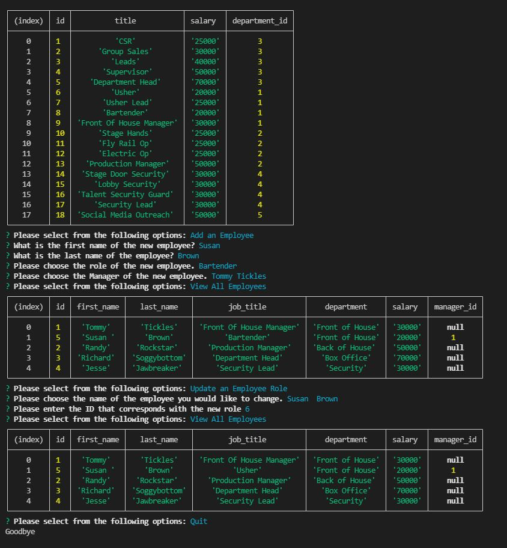

# SQL Employee Tracker
    
## Description
Use this application to keep track of the employees in your company.

## Table of Contents
- [Usage](#Usage)
- [Installation](#Installation)
- [Usage](#Usage)
- [Contributing](#Contributing)
- [Tutorial](#Tutorial)
- [Screenshot](#Screenshot)
- [License](#License)
- [Questions](#Questions)

## Usage
You can use this program to quickly and effeciently check, update or remove an employee's title, department, salary, and employment with the company. 

## Installation
In the SQL Employee Tracker folder, run an npm install and then an npm start. Follow the prompts. 

## Contributing 
Ashby Blakely 

## Tutorial
[Video Walkthrough 1](https://drive.google.com/file/d/1kcD7t4_jpOBWxFfCztnX9v0WKwCzNBjN/view?usp=sharing) 
[Video Walkthrough 2](https://drive.google.com/file/d/1MV33VPGHaFHzLyctY7o9Na5PeREDqxC-/view?usp=sharing)

## Screenshot

## License
MIT

## Questions
[Link to GitHub Profile](https://github.com/AshbyLB) 
Feel free to email me at ashbyleeblakely@gmail.com if you have any questions.

